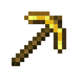
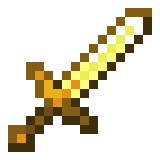

As the name suggests, this mod adds 8 vanilla-like enchantments aiming at increasing your productivity by help you complete tedious tasks like farming and mining faster while not being too _overpowered_. 

Enchantments
------------------

### Cluster (rare) (pickaxe)

Simply mines complete veins of the same ore type. Bigger veins have a greater impact on durability. 

### Magnetism (very rare) (bow, crossbow, sword, pickaxe, axe, shovel, hoe)

Attracts any droped items directly to you. Your best friend for mining over lava or killing flying blazes.

### Digging (I, II, III) (uncommon) (pickaxe, shovel)

Carves an area of blocks. The radius depends on the enchantment level.

### Torching (uncommon) (pickaxe)

Useful when mining. When enchanted, torches can be placed upon right click. 

### Woodcutting (I, II, III) (common) (axe)

Cuts down entire trees. This enchantment also behaves like digging on all wood-type blocks.

### Magnetism (very rare) (bow, crossbow, sword, pickaxe, axe, shovel, hoe)

Attracts any droped items directly to you. Your best friend for mining over lava or killing flying blazes.

### Plowing (I, II, III) (common) (hoe)

Plows an area into farmland. Max enchantment will also fully moisturize fields. The radius depends on the enchantment level.

### Fertility (I, II, III) (common) (hoe)

Allows seeds to be planted or bone meal to be fed on crops over an area upon right click. The radius depends on the enchantment level.

### Cultivation (I, II, III) (uncommon) (hoe)

Harvests fully grown crops in an area. The radius depends on the enchantment level. (final hoe upgrade i swear)

## FAQ

### Mod compatibility?

As far as I know (apart from planting seeds with Fertility), enchantments are cross compatibile with other mods.

### Can I use it in my Modpack?

Feel free to you use this mod however you like (please infrom me of any issues/incompatibilties).

### Will this mod be available in other versions?

As it stands, if I have the time, I may be able to work on other versions such as 1.12.2. Please leave a comment on which version you would like this mod to be available in.

#### Feel free to suggest anything in the comments section.

#### Dont's forget to check out the mod's configs to adjust things to your liking.

#### Please infrom me of any issues here: https://github.com/Than00ber/ProductivityEnchantments/issues. Provide crash logs or a description of what the problem is, this helps a lot. 
